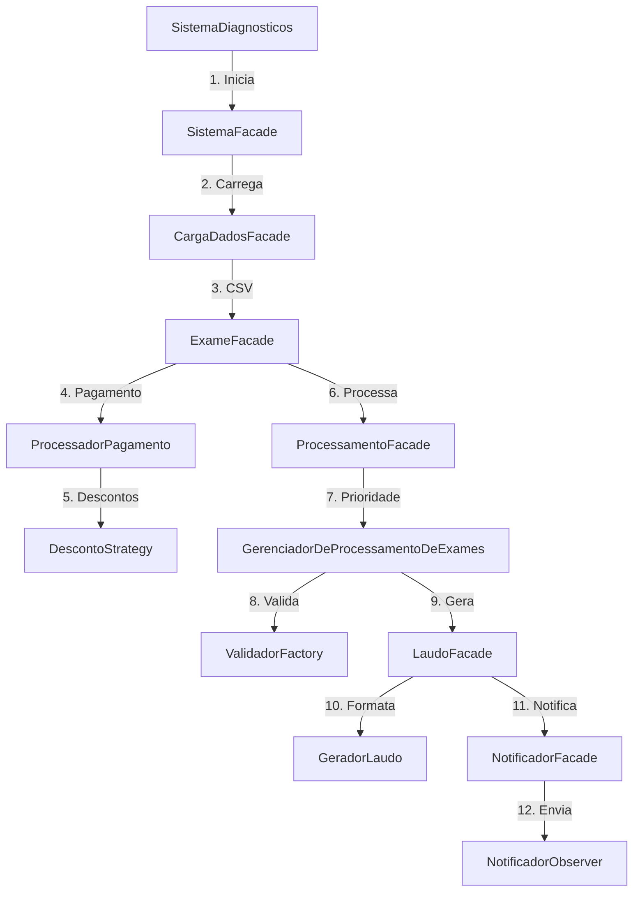
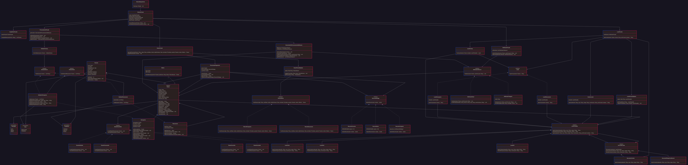
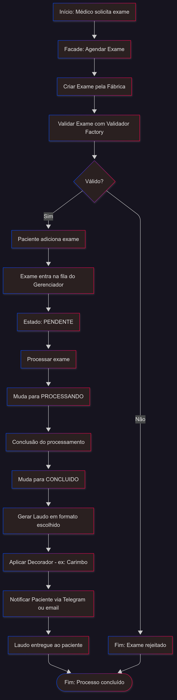

# IF Diagnósticos

Sistema completo para gerenciamento de exames médicos, incluindo agendamento, processamento, pagamento, geração de laudos e envio de notificações automáticas.

## Funcionalidades

* Agendamento de exames médicos com diferentes tipos (Hemograma, Ressonância).
* Processamento de exames com controle de estados (Solicitado, Processando, Concluído, Cancelado).
* Validação específica por tipo de exame com regras especializadas.
* Sistema de descontos flexível (convênio, idade, combinações).
* Geração de laudos em múltiplos formatos (Texto, HTML, PDF).
* Notificações automáticas para pacientes (Email, Telegram).
* Processamento prioritário de exames baseado em urgência.
* Carga de dados a partir de arquivos CSV.

## Arquitetura

O sistema adota uma arquitetura modular baseada em padrões de projeto, organizada em camadas bem definidas.

Camadas principais:

* **Core**: Coordenação do fluxo principal através de fachadas.
* **Model**: Entidades de domínio (Paciente, Médico, Exame).
* **Factories**: Criação de objetos complexos.
* **Validators**: Validação de regras de negócio.
* **Payments**: Processamento de pagamentos e descontos.
* **Reports**: Geração e formatação de laudos.
* **Notifier**: Sistema de notificações.
* **States**: Controle do ciclo de vida dos exames.

## Classes e Responsabilidades

### Sistema

* **SistemaDiagnosticos**: Classe principal, contém o método `main`.
* **SistemaFacade**: Fachada que centraliza o fluxo (agendamento, processamento, pagamento, laudo, notificação).
* **ExameFacade**, **LaudoFacade**, **NotificadorFacade**, **ProcessamentoFacade**, **CargaDadosFacade**: Fachadas especializadas.

### Exames

* **Exame (abstract)**: Classe base que contém informações do exame, paciente, médico e estado.
* **Hemograma, Ressonancia**: Subclasses de `Exame`, especializações com atributos próprios.
* **FabricaExame (interface)**: Define contrato para criação de exames.
* **FabricaHemograma, FabricaRessonancia**: Implementações concretas.
* **ExameFactoryRegistry**: Registro de fábricas disponíveis.

### Validação

* **ValidadorExame (interface)**: Contrato para validadores.
* **ValidadorHemograma, ValidadorRessonancia**: Implementações específicas.
* **ValidadorFactory**: Cria instâncias de validadores corretos para cada exame.

### Pagamento

* **ProcessadorPagamento**: Realiza processamento financeiro.
* **DescontoStrategy (interface)**: Define cálculo de descontos.
* **DescontoConvenio, DescontoIdoso, DescontoComposto**: Estratégias concretas.

### Laudos

* **GeradorLaudo**: Orquestra a criação dos laudos.
* **LaudoTemplate (abstract)**: Estrutura base de laudo (cabeçalho, corpo, rodapé).
* **LaudoTexto, LaudoHtml, LaudoPdf**: Diferentes implementações.
* **DecoradorLaudo (abstract)**: Classe base para adicionar comportamento.
* **DecoradorCarimbo, DecoradorRodapeConfidencial**: Decoradores adicionais.
* **LaudoFactory, LaudoFactoryRegistry**: Criação e registro de templates.

### Processamento de Exames

* **GerenciadorDeProcessamentoDeExames**: Gerencia fila de exames e mudanças de estado com base em prioridade.
* **StatusExameState (interface)**: Define transições possíveis.
* **ExameSolicitado, ExameProcessando, ExameConcluido, ExameCancelado**: Estados concretos.

### Notificações

* **NotificadorObserver (interface)**: Observadores de eventos do sistema.
* **NotificadorEmail, NotificadorTelegram**: Implementações concretas.

### Usuários

* **Paciente**: Contém dados pessoais, exames e informações de convênio.
* **Medico**: Responsável por solicitar exames.

## Relações Entre Classes

| Classe Fonte                       | Relacionada a                                                          | Tipo de Relação |
| ---------------------------------- | ---------------------------------------------------------------------- | --------------- |
| SistemaDiagnosticos                | SistemaFacade                                                          | Composição      |
| SistemaFacade                      | Fábricas, Validadores, Pagamento, Laudos, Processamento, Notificadores | Coordenação     |
| Exame                              | Paciente, Medico, StatusExameState, LaudoTemplate                      | Agregação       |
| FabricaExame                       | FabricaHemograma, FabricaRessonancia                                   | Herança         |
| ValidadorFactory                   | ValidadorExame                                                         | Criação         |
| ProcessadorPagamento               | DescontoStrategy                                                       | Strategy        |
| LaudoTemplate                      | LaudoTexto, LaudoHtml, LaudoPdf                                        | Template Method |
| LaudoTemplate                      | DecoradorLaudo                                                         | Decorator       |
| GerenciadorDeProcessamentoDeExames | NotificadorObserver                                                    | Observer        |
| NotificadorObserver                | NotificadorEmail, NotificadorTelegram                                  | Implementação   |

## Fluxo do Sistema



---
 
 
---

## Padrões de Projeto Utilizados

**1. Facade (`SistemaFacade`)**
* Coordena o fluxo principal do sistema.
* Fachadas especializadas para cada módulo.

**2. Abstract Factory (`FabricaExame`)**
* Criação de famílias de exames.
* Registro dinâmico via `ExameFactoryRegistry`.

**3. State (`StatusExameState`)**
* Ciclo de vida do exame: `Solicitado → Processando → Concluído `.

**4. Strategy (`DescontoStrategy`)**
* Regras intercambiáveis de desconto:
  * `DescontoConvenio`
  * `DescontoIdoso`
  * `DescontoComposto`

**5. Template Method (`LaudoTemplate`)**
* Estrutura fixa de laudos.
* Implementações: `Texto`, `HTML`, `PDF`.

**6. Decorator (`DecoradorLaudo`)**
* Adiciona funcionalidades aos laudos.
* Ex: `Carimbo`, `Rodapé Confidencial`.

**7. Observer (`NotificadorObserver`)**
* Notificações automáticas para pacientes.
* Implementações: `Email`, `Telegram`.

**8. Priority Queue (`GerenciadorDeProcessamentoDeExames`)**
* Processamento baseado em urgência:
  * **ALTA** → prioridade máxima
  * **MÉDIA** → intermediária
  * **BAIXA** → menor prioridade

**9. Validators (`ValidadorExame`)**
* Validar exames e criar validadores.

## Estrutura do Projeto

```plaintext
src/
├── core/
│   ├── SistemaDiagnosticos.java
│   ├── SistemaFacade.java
│   ├── ExameFacade.java
│   ├── LaudoFacade.java
│   ├── NotificadorFacade.java
│   ├── ProcessamentoFacade.java
│   └── CargaDadosFacade.java
├── factories/
│   ├── FabricaExame.java
│   ├── FabricaHemograma.java
│   ├── FabricaRessonancia.java
│   └── ExameFactoryRegistry.java
├── manager/        
│   └── GerenciadorDeProcessamento.java
├── model/
│   ├── enums/
│   │   ├── FaixaEtaria.java
│   │   ├── Prioridade.java
│   │   └── Sexo.java
│   ├── exame/
│   │   ├── Exame.java
│   │   ├── Hemograma.java
│   │   └── Ressonancia.java
│   ├── laudo/
│   │   ├── Laudo.java
│   │   ├── LaudoHemograma.java
│   │   ├── LaudoRessonancia.java
│   ├── Medico.java
│   └── Paciente.java
├── notifier/              
│   ├── NotificadorEmail.java
│   ├── NotificadorTelegram.java
│   └── NotificadorObserver.java
├── payments/            
│   ├── ProcessadorPagamento.java
│   ├── DescontoStrategy.java
│   ├── DescontoConvenio.java
│   ├── DescontoIdoso.java
│   └── DescontoComposto.java
├── reports/       
│   ├── GeradorLaudo.java
│   ├── decorator/
│   │   ├── DecoradorCarimbo.java
│   │   ├── DecoradorLaudo.java
│   │   └── DecoradorRodapeConfidencial.java
│   └── template/
│       ├── LaudoTemplate.java
│       ├── TemplateHemograma.java
│       └── TemplateRessonancia.java
├── resources/
│   ├── dados.csv
├── states/
│   ├── ExameCancelado.java
│   ├── ExameConcluido.java
│   ├── ExameProcessando.java
│   ├── ExameSolicitado.java
│   └── StatusExameState.java
├── validators/
│   ├── ValidadorBase.java
│   ├── ValidadorExame.java
│   ├── ValidadorFactory.java
│   ├── ValidadorHemograma.java
│   └── ValidadorRessonancia.java
```
---

---
## **Como Executar**

Pré-requisitos
Java JDK 11 ou superior

Biblioteca Jakarta Mail (para notificações por email)

1. Clone o repositório:

    ```bash
    git clone https://github.com/seu-usuario/st-diagnosticos.git
    cd st-diagnosticos
    ```
    
2. Compile o projeto:

    ```bash
    javac -d bin -cp "src" src/core/SistemaDiagnosticos.java
    ```
    
3.Execute a aplicação:

    ```bash
    java -cp "bin" core.SistemaDiagnosticos
    ```
4.  Use o menu interativo para:

   * Agendar exames
   * Processar fila
   * Pagar com desconto
   * Gerar laudos
   * Receber notificações

---

## **Benefícios do Sistema**

* **Escalável** → novos exames, laudos, descontos e notificadores podem ser adicionados facilmente.
* **Flexível** → padrões permitem customizações sem alterar código existente.
* **Organizado** → responsabilidades bem separadas entre camadas.
* **Manutenível** → cada funcionalidade encapsulada em sua própria classe.

---

## **Dev**

* **Tecnologias**: Java, Padrões de Projeto
* **Licença**: [MIT](LICENSE)
